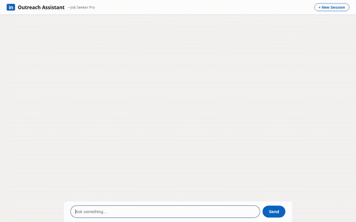

# 💼 LinkedIn Cold Outreach Agent (Job Seeker Pro)

> An agentic LinkedIn outreach assistant built with the Google Agent Development Kit (ADK), Vertex AI Agent Runtime, Vertex AI Memory Bank, Cloud Storage, and Google Cloud Firestore. Designed specifically for active job seekers to turn real hiring posts into personalized, high-converting cold outreach messages.



🔗 **Live Application**: [https://linkedin-outreach-frontend-491267598554.us-central1.run.app](https://linkedin-outreach-frontend-491267598554.us-central1.run.app)

---

## 🎯 What the Agent Does

1. **LinkedIn Lead & Post Ingestion**: Automatically crawls public/shortened LinkedIn post URLs (`https://lnkd.in/...`), extracting structured hiring announcements, target roles, team context, and hiring manager metadata.
2. **Persistent Lead Tracking (Cloud Storage)**: Tracks job leads, candidate target preferences, and outreach history across sessions in Cloud Storage (`posts/saved_posts.json`).
3. **Candidate Memory & Personalization (Vertex AI Memory Bank)**: Leverages long-term conversational memory to recall the candidate's professional background (e.g., Data Engineer at Meta), target job titles (Data Engineer, Analytics Engineer, BIE), and core skill sets (Python, SQL, ETL, data modeling).
4. **Adaptive Outreach Drafting**: Generates hyper-focused 45–80 word cold outreach messages with warm greetings, tailored hooks acknowledging the post, direct active search intent, and a polite, low-pressure ask. Strictly selects only 2–3 matching skills per message.
5. **Quality Flywheel & Scoring**: Evaluates each draft across 4 key dimensions (Greeting & Hook, Skill Alignment, Active Search Intent, Mobile Brevity) and assigns an objective readiness score (0–100).
6. **Rich Visual UI (A2UI)**: Returns structured visual cards (surfaces with Cards, Columns, Rows, Dividers, and Text) directly to the chat interface.

---

## 🏗️ Architecture & Google Cloud Integrations

| Capability | Component / Service | Implementation Status |
| :--- | :--- | :--- |
| **Agent Core** | Google ADK + Gemini 2.5 Flash | ✅ Fully Implemented (`app/agent.py`) |
| **Agent Deployment** | Vertex AI Agent Runtime (Agent Engine) | ✅ Deployed (`us-central1`, A2A protocol) |
| **Long-Term Memory** | Vertex AI Memory Bank (`PreloadMemoryTool`) | ✅ Fully Implemented (`agentengine://...`) |
| **Object Storage** | Google Cloud Storage | ✅ Implemented (`posts/saved_posts.json`) |
| **Candidate Store** | Google Cloud Firestore / Datastore | ✅ Integrated (`app/app_utils/job_seeker_tools.py`) |
| **UI Protocol** | A2UI (Agent-to-User Interface) | ✅ Implemented (`app/a2ui_utils.py`) |
| **Chat Frontend** | FastAPI A2A Proxy + LinkedIn-themed Web UI | ✅ Implemented (`frontend/`) |

---

## 📁 Repository Structure

```
├── app/
│   ├── agent.py                 # ADK Root Agent, callbacks, system prompts & schemas
│   ├── a2ui_utils.py            # A2UI response formatting & payload generator
│   └── app_utils/
│       └── job_seeker_tools.py  # GCS lead store, crawler, evaluation & Firestore tools
├── frontend/
│   ├── main.py                  # FastAPI A2A proxy server with session isolation
│   └── static/
│       └── index.html           # LinkedIn-branded chat frontend with A2UI renderer
├── agents-cli-manifest.yaml     # Agent deployment specifications
└── pyproject.toml               # Project dependencies (google-adk, a2ui, google-cloud)
```

---

## 🚀 Running Locally

### 1. Prerequisites
Ensure Google Cloud authentication is configured:
```bash
gcloud auth application-default login
```

### 2. Run the LinkedIn Chat Application
Start the frontend server (runs on port 8000 and connects via A2A to the deployed agent):
```bash
cd frontend
python main.py
```
Open your browser at `http://localhost:8000` to interact with the assistant.

*(Optional)* If you want to run the raw ADK Agent Developer Web UI instead:
```bash
uv run adk web --port 8080 --allow_origins "*" --reload_agents
```

---

## 🛠️ Tools & Capabilities

The agent exposes the following tools directly to the LLM:
* `fetch_and_save_new_post(post_url, target_role)`: Ingests and parses LinkedIn post URLs and stores them in Cloud Storage.
* `fetch_saved_posts_from_storage(limit, filter_role)`: Queries pending or drafted leads from the GCS bucket.
* `save_post_to_storage(...)`: Manually registers a new hiring opportunity.
* `mark_post_processed_in_storage(post_id, status)`: Transitions a lead from `pending` to `drafted`.
* `get_candidate_profile(candidate_id)`: Fetches candidate background and core skills.
* `evaluate_job_seeker_draft(draft_message, target_role)`: Scores message quality against job-seeker best practices.
* `save_opportunity_draft(...)`: Saves approved drafts for tracking.
